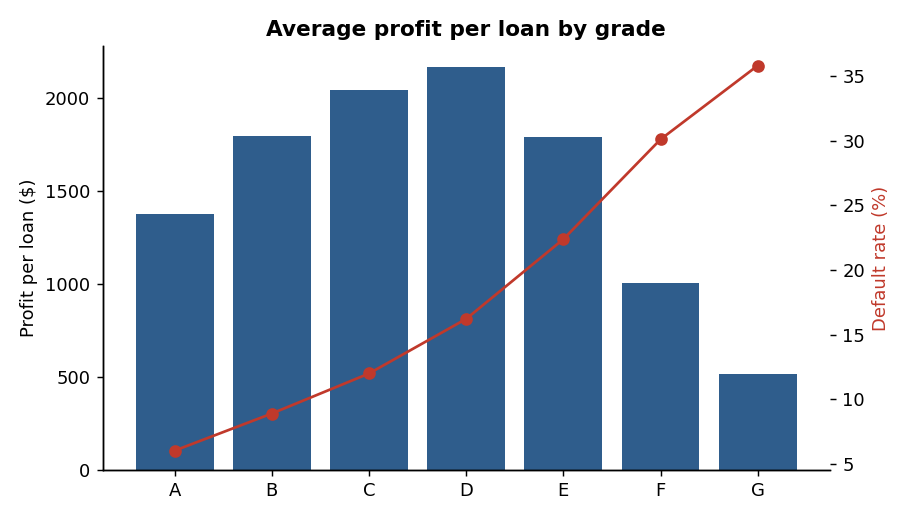

# Loan Default Risk & Portfolio Analytics

**Question:** Which borrowers default, and which approval policy makes a lender more profit, not just fewer defaults?

**Tools:** SQL (SQLite) | Python (pandas, scikit-learn, matplotlib) | Excel | Power BI



## Key findings (50,000 loans, $839M disbursed)
- Default rate rises from **6% (grade A) to 36% (grade G)**, and from **8% to 30%** as debt-to-income goes from under 10 to over 30.
- Profit per loan **peaks at grade D (about $2,170)** and falls to about $520 at grade G, so default rate alone is misleading.
- A logistic regression risk model scores **AUC 0.72 vs 0.67** for lender grade alone (held-out test set).
- Declining the riskiest 20% of applicants would **cut profit by about $6.4M**.
- Declining only loans with **negative expected profit** rejects 6.6% of applicants, lowers the default rate from **15.4% to 13.6%**, and raises profit about **4.4%** on held-out data.

**Recommendation:** Decline or reprice only where expected loss exceeds expected interest income. Do not tighten approvals across the board.

## Repository structure
```
loan-default-risk-analysis/
├── README.md
├── requirements.txt
├── loan_default_risk_analysis.ipynb   # full analysis (run top to bottom)
├── sql/queries.sql                    # 11 SQL queries (CTEs, window functions)
├── excel/Loan_Risk_Policy_Simulator.xlsx   # what-if tool, change the yellow cells
├── charts/                            # key charts
└── powerbi/POWERBI_GUIDE.md           # dashboard build steps + DAX measures
```

## Method
1. **Clean:** removed duplicates, filled missing values with the median, capped extreme incomes at the 99th percentile.
2. **Explore (SQL):** CTEs, window functions (RANK, LAG, NTILE, running SUM), CASE WHEN banding.
3. **Model:** logistic regression (explainable), 70/30 train/test split.
4. **Expected profit:** (chance repaid x interest) - (chance default x loss).
5. **Simulate:** replay history to test approval policies.

## How to run
1. `pip install -r requirements.txt`
2. Open `loan_default_risk_analysis.ipynb` in Jupyter or Google Colab and click **Run all**.
   It creates the data, runs the SQL, trains the model and writes charts, Power BI CSVs and the Excel file.

## Assumptions and limitations
- Data is **synthetic**, modelled on Lending Club fields, so the work is reproducible.
- Loss on default (62.5% of principal) and the interest factor are assumptions.
- A historical replay is not an experiment; a real policy change needs an A/B test.
